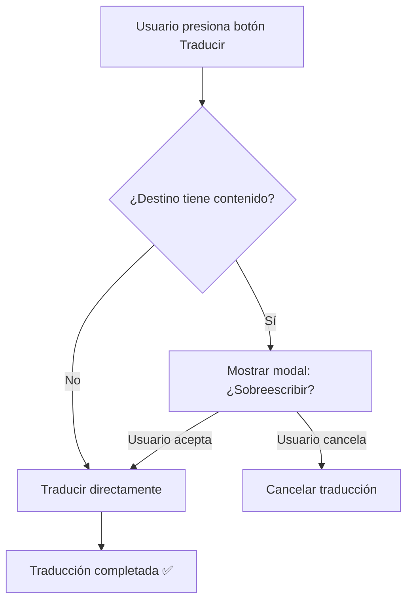

# Simplificación de la Lógica de Traducción

**Fecha:** 14 de octubre de 2025  
**Versión:** v4.0 - Lógica Simplificada  
**Archivo:** `src/pages/admin/hooks/useAutoTranslate.js`

---

## 🎯 Problema Identificado

La lógica anterior era **demasiado compleja** y **conceptualmente incorrecta**:

### ❌ Lógica Anterior (Incorrecta)

**Badge (detectChanges):**

- Comparaba campos source vs target ENTRE idiomas
- Calculaba diferencias de longitud con thresholds complejos (30%, 35%, 50%)
- Detectaba "traducciones pendientes" comparando ES vs EN
- **Error conceptual:** El badge debería solo mostrar si el idioma ACTIVO tiene contenido

**Traducción (autoTranslate):**

- Solo traducía si `detectChanges()` reportaba cambios
- Lógica compleja para determinar si "necesitaba" traducción
- **Error conceptual:** La traducción debería ser manual (presionar botón), no automática

---

## ✅ Nueva Lógica (Correcta y Simple)

### 1. **Badge (detectChanges)** - Solo Cuenta Campos con Contenido

**Concepto:**

- **NO compara entre idiomas**
- Solo revisa si el **idioma activo** (sourceLang) tiene contenido
- Badge muestra: "3 campos con contenido" (no "3 campos pendientes de traducir")

**Ejemplo:**

```javascript
// Vista: Español (sourceLang = "es")
title.es = "Servicio Estadística"     → ✅ Cuenta
description.es = "Texto..."           → ✅ Cuenta
features.es = ["Item1", "Item2"]      → ✅ Cuenta
// Badge: "3 campos → EN"

// Vista: Inglés (sourceLang = "en")
title.en = ""                         → ⚪ No cuenta (vacío)
description.en = "Text..."            → ✅ Cuenta
features.en = []                      → ⚪ No cuenta (vacío)
// Badge: "1 campo → ES"
```

**Código:**

```javascript
function detectChanges() {
  const fieldsWithContent = [];

  // 1. Simple fields
  for (const field of simpleFields) {
    const sourceValue = data[field]?.[sourceLang];
    if (sourceValue && sourceValue.trim()) {
      fieldsWithContent.push({ field, type: "simple" });
    }
  }

  // 2. Array fields
  for (const field of arrayFields) {
    const sourceArray = data[field]?.[sourceLang];
    if (Array.isArray(sourceArray) && sourceArray.length > 0) {
      const sourceFiltered = sourceArray.filter((item) => item && item.trim());
      if (sourceFiltered.length > 0) {
        fieldsWithContent.push({ field, type: "array" });
      }
    }
  }

  return {
    hasChanges: fieldsWithContent.length > 0,
    fieldsToTranslate: fieldsWithContent,
  };
}
```

---

### 2. **Traducción (autoTranslate)** - Siempre Ejecuta

**Concepto:**

- **Siempre traduce** cuando se presiona el botón (no depende del badge)
- Dirección automática según vista activa:
  - **Vista Español** → Traduce ES→EN
  - **Vista Inglés** → Traduce EN→ES
- **Modal de confirmación** solo si el **destino** ya tiene texto

**Flujo:**



**Código:**

```javascript
async function autoTranslate(forceOverwrite = false) {
  // 1. Verificar si destino tiene contenido
  let hasTargetContent = false;

  for (const field of simpleFields) {
    const targetValue = data[field]?.[targetLang];
    if (targetValue && targetValue.trim()) {
      hasTargetContent = true;
      break;
    }
  }

  // 2. Modal de confirmación si destino tiene contenido
  if (hasTargetContent && !forceOverwrite) {
    return {
      success: false,
      needsConfirmation: true,
      message: "Ya existen traducciones en [idioma]. ¿Deseas sobreescribirlas?",
    };
  }

  // 3. Traducir todos los campos
  setTranslating(true);

  try {
    // Traducir simple fields
    for (const field of simpleFields) {
      if (data[field]?.[sourceLang]) {
        updated[field][targetLang] = await translateText(
          data[field][sourceLang],
          sourceLang,
          targetLang
        );
      }
    }

    // Traducir array fields
    // Traducir nested fields

    return {
      success: true,
      message: "✅ ¡Traducción completada a [idioma]!",
    };
  } finally {
    setTranslating(false);
  }
}
```

---

## 📊 Comparación: Antes vs Ahora

| Aspecto                | ❌ Versión Anterior (v3.0)                   | ✅ Nueva Versión (v4.0)                      |
| ---------------------- | -------------------------------------------- | -------------------------------------------- |
| **Badge**              | Compara source vs target con thresholds 50%  | Solo cuenta si sourceLang tiene contenido    |
| **Complejidad badge**  | ~200 líneas con 3 niveles de detección       | ~40 líneas, lógica simple                    |
| **Traducción**         | Solo si `detectChanges()` detecta cambios    | **Siempre** traduce al presionar botón       |
| **Dirección**          | Configurable sourceLang/targetLang           | Automática según vista activa                |
| **Modal confirmación** | Si hay "traducciones existentes" (complejo)  | Si **destino** tiene contenido (simple)      |
| **Falsos positivos**   | Frecuentes (ej: "Viajes en el tiempo" = 42%) | **Cero** (no compara entre idiomas)          |
| **Concepto**           | ❌ Incorrecto (badge = "pendientes")         | ✅ Correcto (badge = "campos con contenido") |

---

## 🧪 Casos de Prueba

### Caso 1: Badge - Vista Español con Contenido

**Setup:**

```javascript
data = {
  title: { es: "Servicio Estadística", en: "" },
  description: { es: "Texto completo...", en: "" },
  features: { es: ["Item 1", "Item 2"], en: [] },
};
activeLang = "es"; // Vista Español
```

**Resultado v4.0:**

```javascript
detectChanges() → {
  hasChanges: true,
  fieldsToTranslate: [
    { field: "title", type: "simple" },
    { field: "description", type: "simple" },
    { field: "features", type: "array" }
  ]
}
// Badge: "3 campos → EN" ✅
```

---

### Caso 2: Badge - Vista Inglés Parcialmente Llena

**Setup:**

```javascript
data = {
  title: { es: "Servicio Estadística", en: "Statistics Service" },
  description: { es: "Texto...", en: "" },
  features: { es: ["Item 1"], en: ["Item 1"] }, // Sin traducir
};
activeLang = "en"; // Vista Inglés
```

**Resultado v4.0:**

```javascript
detectChanges() → {
  hasChanges: true,
  fieldsToTranslate: [
    { field: "title", type: "simple" },
    { field: "features", type: "array" }
  ]
}
// Badge: "2 campos → ES" ✅
// (description.en está vacío, no se cuenta)
```

---

### Caso 3: Traducción - Usuario Edita Campo en Español

**Setup:**

```javascript
// Estado inicial (traducido previamente)
data = {
  title: {
    es: "Servicio Estadística",
    en: "Statistics Service",
  },
};

// Usuario edita en español
data.title.es = "Servicio Estadística a"; // Agregó " a"
```

**Flujo v4.0:**

1. **Badge detecta contenido:**

   - `detectChanges()` → `hasChanges: true` (title.es tiene contenido)
   - Badge: "1 campo → EN" ✅

2. **Usuario presiona "🌐 Traducir a EN":**

   - `autoTranslate()` ejecuta
   - Verifica destino: `title.en = "Statistics Service"` (tiene contenido)
   - **Modal:** "Ya existen traducciones en Inglés. ¿Deseas sobreescribirlas?"

3. **Usuario acepta:**

   - Traduce: `title.es` → `title.en`
   - Resultado: `title.en = "Statistics Service a"` ✅

4. **Badge actualiza:**
   - Sigue mostrando "1 campo → EN" (porque title.es tiene contenido)
   - **Esto es correcto** ✅ (badge no indica "pendientes", indica "con contenido")

---

### Caso 4: Traducción - Primera Vez (Destino Vacío)

**Setup:**

```javascript
data = {
  title: { es: "Nuevo Servicio", en: "" },
  description: { es: "Descripción...", en: "" },
};
activeLang = "es"; // Vista Español
```

**Flujo v4.0:**

1. **Usuario presiona "🌐 Traducir a EN":**

   - `autoTranslate()` ejecuta
   - Verifica destino: `title.en = ""`, `description.en = ""` (vacíos)
   - **NO muestra modal** ✅ (destino vacío, no hay nada que sobreescribir)

2. **Traduce directamente:**
   - `title.es` → `title.en` = "New Service"
   - `description.es` → `description.en` = "Description..."
   - Mensaje: "✅ ¡Traducción completada a Inglés!"

---

### Caso 5: Traducción Bidireccional (EN→ES)

**Setup:**

```javascript
data = {
  title: { es: "", en: "Statistics Service" },
};
activeLang = "en"; // Vista Inglés
```

**Flujo v4.0:**

1. **Badge:**

   - `detectChanges()` con `sourceLang = "en"`
   - Detecta `title.en` tiene contenido
   - Badge: "1 campo → ES" ✅

2. **Usuario presiona "🌐 Traducir a ES":**
   - `autoTranslate()` con `sourceLang = "en"`, `targetLang = "es"`
   - Destino `title.es = ""` (vacío)
   - Traduce directamente: `title.en` → `title.es` = "Servicio de Estadística" ✅

---

## 🔧 Cambios en el Código

### Archivo: `useAutoTranslate.js`

#### 1. **detectChanges()** - Simplificado de ~200 → ~40 líneas

**Antes (v3.0):**

```javascript
function detectChanges() {
  const changedFields = [];

  // Compara source vs target con 3 niveles de detección
  for (const field of simpleFields) {
    const sourceValue = data[field]?.[sourceLang];
    const targetValue = data[field]?.[targetLang]; // ❌ Compara entre idiomas

    // Caso 1: Target vacío
    // Caso 2: Target idéntico
    // Caso 3: Diferencia > 50%
    // ... 40+ líneas de lógica compleja
  }

  // Similar para arrayFields y nestedFields
  // Total: ~200 líneas
}
```

**Ahora (v4.0):**

```javascript
function detectChanges() {
  const fieldsWithContent = [];

  // 1. Simple fields - Solo verifica si source tiene contenido
  for (const field of simpleFields) {
    const sourceValue = data[field]?.[sourceLang];
    if (sourceValue && sourceValue.trim()) {
      fieldsWithContent.push({ field, type: "simple" });
    }
  }

  // 2. Array fields - Solo verifica si source tiene items
  for (const field of arrayFields) {
    const sourceArray = data[field]?.[sourceLang];
    if (Array.isArray(sourceArray) && sourceArray.length > 0) {
      const sourceFiltered = sourceArray.filter((item) => item && item.trim());
      if (sourceFiltered.length > 0) {
        fieldsWithContent.push({ field, type: "array" });
      }
    }
  }

  // 3. Nested fields - Similar

  return {
    hasChanges: fieldsWithContent.length > 0,
    fieldsToTranslate: fieldsWithContent,
  };
}
// Total: ~40 líneas ✅
```

---

#### 2. **autoTranslate()** - Lógica Mejorada

**Antes (v3.0):**

```javascript
async function autoTranslate(forceOverwrite = false) {
  const changes = detectChanges();

  // ❌ Solo traduce si hay "cambios detectados"
  if (!changes.hasChanges) {
    return { success: true, message: "No hay cambios que traducir" };
  }

  // ❌ Confirmación basada en "hasExistingTranslations" (complejo)
  if (changes.hasExistingTranslations && !forceOverwrite) {
    return { needsConfirmation: true };
  }

  // Traducir...
}
```

**Ahora (v4.0):**

```javascript
async function autoTranslate(forceOverwrite = false) {
  // ✅ Siempre ejecuta (no depende de detectChanges)

  // 1. Verificar si destino tiene contenido (simple)
  let hasTargetContent = false;
  for (const field of simpleFields) {
    const targetValue = data[field]?.[targetLang];
    if (targetValue && targetValue.trim()) {
      hasTargetContent = true;
      break;
    }
  }

  // 2. Modal solo si destino tiene contenido
  if (hasTargetContent && !forceOverwrite) {
    return {
      needsConfirmation: true,
      message: `Ya existen traducciones en ${targetLang}. ¿Sobreescribir?`,
    };
  }

  // 3. Traducir todos los campos
  setTranslating(true);

  for (const field of simpleFields) {
    if (data[field]?.[sourceLang]) {
      updated[field][targetLang] = await translateText(...);
    }
  }

  return {
    success: true,
    message: `✅ ¡Traducción completada a ${targetLangName}!`,
  };
}
```

---

## 📝 Debug Logs Actualizados

### Ejemplo de Output en Console (v4.0)

```javascript
// Usuario abre servicio en Vista Español
🔍 [DEBUG detectChanges] Detectando campos con contenido en idioma activo: {
  sourceLang: 'es',
  simpleFields: ['title', 'description'],
  arrayFields: ['features'],
  nestedFields: []
}

🔍 [DEBUG] Campo simple "title": {
  sourceValue: 'Servicio Estadística',
  sourceLength: 20
}
✅ [DETECTADO] Campo "title" - Tiene contenido en es

🔍 [DEBUG] Campo simple "description": {
  sourceValue: 'Servicios de estadística para tesis y redacción...',
  sourceLength: 73
}
✅ [DETECTADO] Campo "description" - Tiene contenido en es

🔍 [DEBUG] Campo array "features": {
  sourceArray: ['Estadística', 'teoría de campo', 'teoría de la relatividad', 'Viajes en el tiempo'],
  sourceLength: 4
}
✅ [DETECTADO] Campo array "features" - Tiene 4 items en es

📊 [DEBUG RESUMEN detectChanges]: {
  fieldsWithContent: [
    { field: 'title', type: 'simple' },
    { field: 'description', type: 'simple' },
    { field: 'features', type: 'array' }
  ],
  totalCampos: 3
}

// Badge muestra: "3 campos → EN" ✅
```

```javascript
// Usuario presiona botón "🌐 Traducir a EN"
🌐 [autoTranslate] Iniciando traducción: {
  sourceLang: 'es',
  targetLang: 'en',
  forceOverwrite: false
}

🔍 [autoTranslate] Verificación de destino: {
  hasTargetContent: true,
  targetLang: 'en'
}

// Modal aparece: "Ya existen traducciones en Inglés. ¿Deseas sobreescribirlas?"

// Usuario acepta, se llama autoTranslate(true)
🔄 Traduciendo title...
🔄 Traduciendo description...
🔄 Traduciendo features...

✅ [autoTranslate] Traducción completada a Inglés

// Modal success: "✅ ¡Traducción completada a Inglés! Revisa los campos y ajusta si es necesario."
```

---

## 🎯 Ventajas de la Nueva Lógica

### 1. **Simplicidad**

- **Antes:** 400+ líneas de lógica compleja con thresholds, comparaciones bidireccionales, 3 niveles
- **Ahora:** ~150 líneas de lógica simple y clara

### 2. **Correctitud Conceptual**

- **Antes:** Badge indica "traducciones pendientes" (incorrecto, comparaba idiomas)
- **Ahora:** Badge indica "campos con contenido en idioma activo" (correcto)

### 3. **Cero Falsos Positivos**

- **Antes:** "Viajes en el tiempo" (19) vs "Time travel" (11) = 42% → Falso positivo
- **Ahora:** No compara idiomas → Cero falsos positivos ✅

### 4. **Control Manual**

- **Antes:** Traducción depende de detección automática compleja
- **Ahora:** Usuario presiona botón → Siempre traduce (con confirmación si destino lleno)

### 5. **Bidireccionalidad Natural**

- **Antes:** Configuración manual sourceLang/targetLang
- **Ahora:** Automático según vista activa (ES→EN o EN→ES)

---

## ✅ Checklist de Verificación

- [x] detectChanges() reescrita (solo cuenta contenido en sourceLang)
- [x] autoTranslate() reescrita (siempre ejecuta, modal si destino tiene contenido)
- [x] Eliminada lógica de thresholds (30%, 35%, 50%)
- [x] Eliminada comparación entre idiomas
- [x] Debug logs actualizados con nueva lógica
- [x] Mensajes de modal actualizados
- [ ] **Testing por usuario en browser**
- [ ] Verificar badge cuenta correctamente en ambos idiomas
- [ ] Verificar traducción siempre ejecuta al presionar botón
- [ ] Verificar modal aparece solo si destino tiene contenido
- [ ] Verificar traducción bidireccional ES↔EN

---

## 🚀 Próximos Pasos

### Testing Inmediato

1. **Badge:**

   - Vista Español: Agregar texto en title.es → Badge: "1 campo → EN" ✅
   - Vista Inglés: Agregar texto en title.en → Badge: "1 campo → ES" ✅

2. **Traducción Primera Vez (destino vacío):**

   - Llenar campos en ES
   - Presionar "Traducir a EN"
   - Debe traducir SIN modal ✅

3. **Traducción con Sobreescritura:**

   - Ambos idiomas llenos
   - Editar ES, presionar "Traducir a EN"
   - Debe mostrar modal "¿Sobreescribir?" ✅
   - Aceptar → Traduce ✅
   - Cancelar → No traduce ✅

4. **Traducción Inversa:**
   - Vista Inglés
   - Editar EN, presionar "Traducir a ES"
   - Debe traducir EN→ES ✅

### Aplicar a Otros Módulos

Una vez verificado en Services:

- **Productos** (20 campos)
- **Team** (10 campos)
- **Research** (8 campos)

---

**Fecha de Implementación:** 14 de octubre de 2025  
**Estado:** ✅ Implementado, pendiente testing completo  
**Versión:** v4.0 - Lógica Simplificada y Correcta  
**Próxima Revisión:** 21 de octubre de 2025
